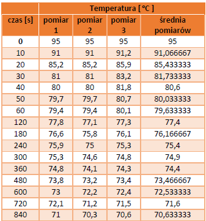
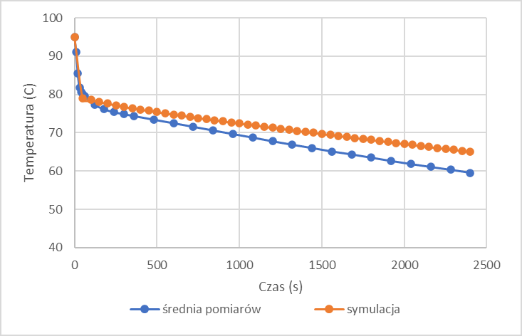

# MES symulacja transportu ciepła w ceramicznynm kubku:
1. Opis problemu: 
    -  Program zakłada zasymulowanie ochładzania się cieczy (wody o temperaturze 100oC) w kubku ceramicznym.

        
    -  W celu porównania wyników został przeprowadzony pomiar rzeczywistych danych. Aby w późniejszym etapie móc porównywać tylko i wyłącznie transport ciepła poprzez ścianki boczne kubka problem uproszczono zakładając izolację od góry i od dołu kubka.

        
    -  Prowadzony był trzykrotny pomiar temperatury w odstępach co 10s przez pierwszą 1min. Następnie co 1min aż do 6 min i dalej co 2 min aż do 40 min. Pomiar temperatury wody był prowadzony sondą. Planowany pomiar temperatury kubka nie był prowadzony ze względu na dużą niedokładność termometru emisyjnego.
    -  Dokładność sondy to ±0,1oC.
    -  W trakcie pomiarów zaobserwowano nieprzewidziany problem w postaci konwekcyjnej wymiany ciepła pomiędzy kubkiem a wodą w pierwszych 50 s co skutkowało gwałtownym spadkiem temperatury płynu. W programie uwzględniono tą konwekcję.
    -  Dodatkowo w celu porównania przeprowadzono 2 symulacje: w pierwszej kubek miał temperaturę pokojową, natomiast w drugiej został podgrzany do temperatury wody. W pierwszym przypadku występowała konwekcja pomiędzy kubkiem a wodą, natomiast w drugiej nie występowała – dominującą metodą wymiany ciepła stało się przewodzenie.
    -  Do symulacji użyto napisanego w całości samodzielnie programu na podstawie algorytmu metody elementów skończonych. 
2. Symulacja:
    -  W celu wygenerowania siatki został napisany program generator.cpp. Program ten w funkcji main przyjmuje od użytkownika parametry ogólne i parametry kubka oraz wpisuje parametry wody. W funkcji licz() program wylicza odpowiednie współrzędne wierzchołków.
    -  Współrzędne są wyliczane według schematu:

        
    -  Na schemacie zaprezentowano przykładowy element oraz metodę rozwiązania problemu środka koła (jak podzielić w ostatnim etapie wierzchołki tak aby powstały czworokąty – liczba wierzchołków na pojedynczym okręgu musi być podzielna przez 2). Dwa pierwsze rzędy wierzchołków to punkty symulujące kubek, pozostałe symulują wodę.
    -  Przykład wygenerowanego pliku to plik generated_example.txt
    -  Oznaczenie danych w generowanym pliku:
            
        -  SimulationTime - czas symulacji
        -  SimulationStepTime  - czas kroku czasowego
        -  Conductivity - przewodność cieplna dla kubka
        -  Alfa - parametr alfa konwekcyjnej wymiany ciepła pomiędzy kubkiem a powietrzem
        -  Tot - temperatura otoczenia
        -  InitialTemp - temperatura wstępna kubka
        -  Density - gęstość kubka
        -  SpecificHeat - ciepło właściwe dla kubka
        -  Nodes number - ilość wierzchołków siatki
        -  Elements number - ilość elementów siatki
        -  *Node - początek listy wierzchołków wraz z ich współrzędnymi w układzie dwuwymiarowym
        -  *Element - początek listy elementów wraz z id odpowiadający im punktom
        -  *BC - lista wierzchołków znajdjących się na granicy kubek-powietrze bądź kubek-woda
        -  Conductivity2 - przewodność cieplna wody
        -  InitialTemp2 - temperatura wstępna wody
        -  Density2 - gęstość wody
        -  SpecificHeat2 - ciepło właściwe wody
        -  NoWaterNr - ilość węzłów siatki symlujących kubek
        -  Alfa2 - parametr alfa konwekcyjnej wymiany ciepła pomiędzy wodą a kubkiem
    -  Główny plik symulacji to program2.cpp. Plik uklad.cpp odpowiada za rozwiązanie układu równań metodą eliminacji Gaussa.
    -  Dodatkowo zaimplementowano symulację konwekcji pomiędzy wodą a kubkiem w pierwszym kroku (do 50s). Wynika ona z dużej różnicy temperatur pomiędzy ścianką a płynem, w późniejszym etapie temperatury się wyrównują i dominującą metodą wymiany ciepła pomiędzy wodą, a kubkiem staje się przewodzenie, gdyż różnice są za małe aby zaistniała konwekcja. Przez całą symulację zachodzi konwekcja pomiędzy powietrzem a kubkiem.
    -  W celu zasymulowania mieszania się płynu zastosowano po każdym kroku wyliczanie średniej ze wszystkich punktów siatki które symulują wodę i wpisanie tej średniej do wartości temperatur odpowiadającej tym punktom.
    -  Dodatkowo zastosowano generowanie plików z danymi wyjściowymi z symulacji do plików programu ParaView w celu późniejszej wizualizacji.
    - dane materiałowe:

        
    - Linki:

        -  Link 1: https://home.agh.edu.pl/~siwek/Maszyny_I_Urzadzenia_Energetyczne_2017/Z.5.%20Turbiny%20Gazowe/Tablice%20powietrze.pdf
        -  Link 2: https://www.engineeringtoolbox.com/
        -  Link 3: https://zpe.gov.pl/pdf/PikrUEi1z
        -  Link 4: https://pl.wikipedia.org/wiki/Lepko%C5%9B%C4%87
        -  Link 5: https://pl.wikipedia.org/wiki/Przyspieszenie_ziemskie
        -  Link 6: https://home.agh.edu.pl/~lhajder/wp-content/uploads/2019/04/Konwekcja.pdf
        -  Ad 7: Ze względu na nie określony ściśle materiał wartość ta została określona na poziomie średniej dla różnych wyrobów ceramicznych podobnego gatunku z wielu stron internetowych.
    -  Wymiary kubka i przyjęte parametry wstępne:

        
    -  Obliczone wartości:

        
        
    -  Obliczanie α dla powietrza: Jako wymiar charakterystyczny uznano wysokość kubka (l=0,11m). Na podstawie obliczonego GrPr zaklasyfikowano konwekcję jako przejściową i na tej podstawie dobrano parametry C=0,54 i n = ¼. Na podstawie tych wartości dalej obliczono wartość α.
    -  Obliczanie α dla wody: Jako wymiar charakterystyczny uznano wewnętrzną wysokość kubka (l=0,1m). Na podstawie obliczonego GrPr zaklasyfikowano konwekcję jako turbulentną i na tej podstawie dobrano parametry C=0,135 i n = 1/3. Na podstawie tych wartości dalej obliczono wartość α.
    -  Ze względu na bardzo małą ilość ciepła przetransportowaną w procesie promieniowania można założyć że α = αkonw.

3. Opis plików:
    - plik program2.cpp zawiera:

        -  Struktury GlobalData przetrzymującej podstawowe dane wczytane z pliku.
        -  Struktury type wszytującej punkty całkowania i ich wagi potrzebne do kwadratury Gaussa
        -  Struktury node, która opisywała pojedynczy węzeł siatki.
        -  Struktury element opisującej pojedynczy element siatki. W tej strukturze znajdowała się także funkcja jakobian() obliczająca wszystkie macierze i wektory dla elementów siatki. W tej funkcji znajdowała się także definicja ilu punktowa interpolacja jest stosowana.
        -  Struktury ElemUni zawierającej wszystkie wartości opisujące element uniwersalny potrzebne do obliczeń w funkcji jakobian()
        -  Struktury Surface opisującej ściany elementu uniwersalnego
        -  Struktury grid opisującej siatkę i zawierającej funkcje agregacja() służącą do agregowania danych z macierzy lokalnych do globalnych oraz funkcję H_local() wywołującą funkcję jakobian() dla każdego elementu.
        -  Strukturę soe przetrzymującą macierze i wektory globalne oraz funkcje roz() sterującą danymi potrzebnymi do obliczenia układu równań, funkcję pomocniczą macierz_wektor() mnożącą macierz przez wektor oraz funkcję licz() sterującą rozwiązywaniem układu równań, które realizowane jest w pliku układ.cpp
        -  Dodatkowo program zawiera funkcje:

            -  Odczyt() odczytującą dane z pliku
            -  toFile() zapisującą dane do pliku .vtk
            -  Dwie przeciążone funkcje uni_show: jedna do wyświetlania w konsoli macierzy, druga do wyświetlania w konsoli wektora.
    -  Plik układ.cpp składa się z:
        -  Funkcji GaussPP() obliczającej macierz pośrednią
        -  Funkcji x() stosującej eliminację Gaussa.
    -  Plik generator.cpp zawiera generator siatki wraz z danymi wstępnymi. Składa się z:
        
        -  Struktury node, która opisywała pojedynczy węzeł siatki.
        -  Funkcji main wpisującej dane do pliku oraz wczytującej wszystkie dane podstawowe.
        -  Funkcji licz obliczającej wszystkie węzły siatki.
    -  Plik genereted_example.txt zawiera przykładowe dane wygenerowane generatorem
    -  Plik znajdujące się w folderze group_nazwa_spraw to pliki wygenerowane z danych wyjściowych służące do późniejszej wizualizacji.

4. Wyniki pomiarów laboratoryjnych:

    

    
5. Tabela wyników temperatury wody dla symulacji – kubek w temperaturze pokojowej (pierwsze 20 min): 

    
6. Przykładowe wyniki symulacji – kubek w temperaturze pokojowej:

    
7. Wykresy:
    -  Wykres zgodności symulacji z rzeczywistością – kubek w temperaturze pokojowej:

        
    -  Wykres zależności temperatur – kubek w temperaturze pokojowej:
        
    -  Porównanie temperatury wody w czasie w zależności od podgrzania kubka przed nalaniem wody - symulacja:

        
    - Przykład graficznej reprezentacji temperatur w programie ParaView:

        
8. Interpetacja wyników:
    -  Przyjęto na podstawie obserwacji że kubek ma właściwości zbliżone do porcelany, choć ściśle rzecz biorąc nie jest on z porcelany, choć jest wyrobem ceramicznym. Tam gdzie było to możliwe brane były wartości ogólne dla materiałów ceramicznych, a gdzie nie było to możliwe brane były wartości dla porcelany.
    -  W pierwszych 50s następuje znaczny spadek temperatury płynu, który jest konieczny na wyrównanie temperatury pomiędzy wodą, a kubkiem. Ciepło to jest przekazywane w procesie konwekcji.
    -  Zauważono że woda przez samo nalewanie do kubka traciła 5oC (nie wliczając wartości koniecznej na ogrzanie kubka). Ciepło to jest tracone poprzez kontakt z powietrzem jeszcze przed kontaktem z kubkiem. Z tego powodu założono w symulacji wstępną temperaturę 95 oC. W praktyce wartość tą uzyskano z maksymalnej zanotowanej temperatury.
    -  Początkowy spadek temperatury na symulacji pokrywa się z rzeczywistością. Dalej realna temperatura wody coraz mniej się pokrywa z symulacją, choć jest to w granicach błędu.
    -  Na podstawie przykładowych wyników można określić, że wartości obliczają się prawidłowo gdyż punkty w takiej samej odległości od brzegu kubka mają taką samą temperaturę, a każdy punkt reprezentujący wodę ma identyczną temperaturę. Różnica temperatur w obszarze wody zachodzi tylko w warstwie przyściennej kubka przy interpolowaniu wartości pomiędzy ostatnią linią punktów kubka, a pierwszą linią punktów wody. Jest to zgodne z fizyką i założeniem warstwy przyściennej przy wymianie ciepła.
9. Wnioski:
    -  Wlewając wrzącą wodę do kubka tracone jest blisko 20oC w pierwszych 50 sekundach. Ta utrata ciepła powodowana jest gwałtowną konwekcją na granicy kubek-woda. Konwekcja ta ustaje po tym czasie i dalej dominującą metodą staje się przewodnictwo. Oznacza to że gdy np. wkładając torebkę herbaty po nalaniu wody prawie na pewno będzie się ona parzyła w temperaturze nie wyższej niż 80oC.
    -  W kolejnych krokach woda traci 20oC dopiero po 40 min. Pokazuje to dodatkowo że obserwacja z punktu pierwszego ma duże znaczenie dla temperatury płynu.
    -  Z wykresu temperatur dla kubka podgrzanego i niepodgrzanego można wywnioskować że to czy podgrzeje się kubek przed nalaniem wrzątku ma duże znaczenie na czas w jakim napój zostanie ciepły i może wydłużyć czas w którym napój jest ciepły nawet o 40 min. Wyjaśnia to również faktyczną konieczność podgrzewania filiżanek w kawiarniach przed nalaniem do nich kawy.
    -  Rozbieżność pomiędzy symulacją, a realnymi wartościami może wynikać z wielu czynników – np. z nieuwzględnionej utraty ciepła przez ucho kubka lub przez nieidealną symulację styropianem. Symulacja również nie uwzględnia utraty ciepła potrzebnej na ogrzanie dna kubka i ciepła pobieranego przez sondę do pomiarów. Może to też wynikać z braku idealnie dokładnych parametrów kubka ze względu na brak ściśle określonego materiału.
    -  Na podstawie wykresu zależności temperatur oraz na podstawie graficznego przedstawienia można zaobserwować że na początku różnica temperatur pomiędzy zewnętrzną ścianką kubka, a temperaturą wody jest wysoka, po czym wraz z upływem czasu różnica ta maleje i stabilizuje się po ok. 250 sekundach i dalej spada temperatura całego układu. Największe różnice temperatur zachodzą w pierwszych 50s co potwierdza założenie konwekcji. Dodatkowo można również wywnioskować że po ok. 4 min od nalania wody do kubka temperatura kubka już nie wzrośnie i będzie jedynie powoli i systematycznie maleć.
    -  Pomimo dużych strat ciepła na ogrzanie kubka dość długo kubek trzyma ciepło.
    -  Termometr emisyjny jest zbyt niedokładny żeby prowadzić nim pomiary, znacznie lepiej sprawdziła się sonda kuchenna.
    -  Wszystkie wnioski odnoszą się do układu uproszczonego ze styropianem, a więc nie można ich bezpośrednio odnieść do codziennych zjawisk, choć pośrednio wskazują one tendencję zjawisk i rolę tych zjawisk w wymianie ciepła. Dodatkowo warto zaznaczyć że dane te zostały uzyskane dla konkretnego kubka i dla innych materiałów i innych kształtów mogą się one różnić.